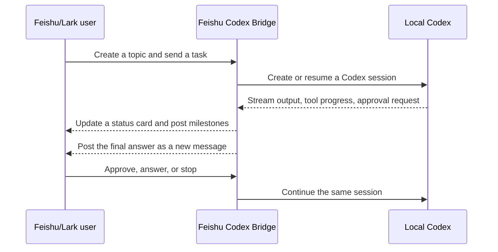

# Feishu Codex Bridge

[](https://github.com/lengjingxu/feishu-codex-bridge/actions/workflows/ci.yml)
[](https://github.com/lengjingxu/feishu-codex-bridge/actions/workflows/codeql.yml)
[](https://nodejs.org/)
[](LICENSE)

[Project site](https://lengjingxu.github.io/feishu-codex-bridge/) · [简体中文](README.md) · [Agent install guide](AGENT_INSTALL.md) · [Security](SECURITY.md) · [Contributing](CONTRIBUTING.md)

**Continue local Codex sessions from Feishu or Lark: one project per group,
one session per topic.**

Check live progress, approve tool calls, provide additional input, stop a run,
or continue a conversation from your phone. The bridge connects outbound to
Feishu/Lark and runs the Codex `app-server` locally, so it needs no public
webhook and exposes no inbound port.

> Your code, credentials, and Codex sessions stay on your machine. Feishu or
> Lark is the interaction surface.

## Why use it?

| Capability | Experience |
| --- | --- |
| Native topic-to-session mapping | Projects and tasks remain isolated; existing sessions can be resumed |
| Live status cards and optional auto-sync | Follow tool progress and results away from your computer |
| Approval and multi-question input cards | Handle one-off/session approvals and structured Codex questions directly in chat |
| Review, fork, compact, search, and undo archive | Use richer app-server workflows without leaving Feishu |
| Outbound long connection | No public server, webhook, or inbound port |
| Access control and encrypted keystore | Limit users, chats, admins, and visible project roots |
| Codex and OMP backends | Use Codex for new workflows while keeping Oh My Pi compatibility |

## How it works



Typical uses:

- follow a local coding task while commuting;
- approve commands or answer Codex without returning to the computer;
- manage parallel Codex sessions as separate topics;
- resume desktop sessions from a phone;
- use a local agent remotely without exposing the development machine.

## Quick start

Requirements:

- Node.js 20.12 or newer;
- pnpm;
- Codex installed and signed in on the host machine.

The CLI can create the Feishu or Lark custom app through Feishu's official
confirmation flow.

```bash
git clone https://github.com/lengjingxu/feishu-codex-bridge.git
cd feishu-codex-bridge
pnpm install
pnpm build
node bin/feishu-omp-bridge.mjs setup
node bin/feishu-omp-bridge.mjs start
```

`setup` shows an official Feishu QR code and confirmation link. The bot
capability, required permissions, event subscriptions, and card callback are
pre-filled. After confirmation, the App Secret goes directly into the local
encrypted keystore and is never printed or written into the repository.

Running `run` without a configuration enters the same flow. On an existing
installation, `setup` incrementally grants missing permissions to the current
app. Use `setup --new-app` only when you intentionally want another app.

An administrator still needs to review and approve the requested permissions,
publish the app version, and configure the correct availability scope. The
Bridge uses Feishu's long connection and does not require a public webhook.

The `feishu-omp-bridge` CLI name is retained for compatibility. The package
also exposes the `feishu-codex-bridge` command alias.

## Enable Codex project mode

After the first run, edit `~/.feishu-omp-bridge/config.json`:

```json
{
  "preferences": {
    "agentBackend": "codex",
    "projectRoots": [
      "/Users/you/projects",
      "/Users/you/work"
    ]
  }
}
```

`projectRoots` adds directories to the project picker. The bridge also
discovers directories from unarchived Codex sessions.

## Feishu workflow

1. Send `项目` or `开始` to the bot in a direct message.
2. Select a local project. The bridge creates a private topic group.
3. Create a native Feishu topic and send the first task.
4. The bridge creates a Codex session and binds it to that topic.
5. Continue chatting in the same topic to resume the same session.

Historical sessions can be restored from the session card. Status cards
support manual refresh and an optional five-second auto-sync mode that edits
the same card instead of sending repeated messages.

Active runs use non-streaming progress cards so long tasks are not constrained
by CardKit's streaming lifetime. The bridge rotates the card every eight
minutes, posts rate-limited milestone messages, falls back to ordinary messages
after an update failure, and always posts the final answer as a new message.

Prefix a message with `!` while a turn is running to steer that same turn; the
bridge acknowledges whether Codex accepted it. Completion cards summarize code
changes, tests/tool calls, and context usage, with actions for review, fork, and
context compaction. Session cards support title search and undo after archive;
forking creates and binds a new Feishu topic while preserving the source topic.

## Service management

```bash
node bin/feishu-omp-bridge.mjs run
node bin/feishu-omp-bridge.mjs start
node bin/feishu-omp-bridge.mjs status
node bin/feishu-omp-bridge.mjs restart
node bin/feishu-omp-bridge.mjs stop
node bin/feishu-omp-bridge.mjs ps
```

Background services use launchd on macOS, systemd user services on Linux, and
Task Scheduler on Windows.

## Security

The bridge can drive an agent on your machine. Configure `allowedUsers`,
`allowedChats`, and `admins`, limit `projectRoots`, and restrict the app's
availability in Feishu/Lark.

Never commit `~/.feishu-omp-bridge/`, logs, session files, real identifiers,
or credentials. See [SECURITY.md](SECURITY.md) for deployment guidance and
private vulnerability reporting.

## Development

```bash
pnpm install
pnpm check
pnpm run audit
```

Contributions are welcome. See [CONTRIBUTING.md](CONTRIBUTING.md).

## License

[MIT](LICENSE)
