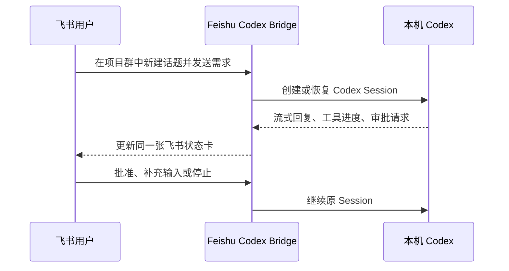

# 飞书 Codex Bridge

[](https://github.com/lengjingxu/feishu-codex-bridge/actions/workflows/ci.yml)
[](https://github.com/lengjingxu/feishu-codex-bridge/actions/workflows/codeql.yml)
[](https://nodejs.org/)
[](LICENSE)

[English](README.en.md) · [安全政策](SECURITY.md) · [参与贡献](CONTRIBUTING.md)

**在飞书里远程继续本机 Codex：一个项目一个群，一个会话一个话题。**

用手机或飞书桌面端查看实时执行进度、批准工具调用、补充输入、停止任务和继续追问。Bridge 通过飞书/Lark 长连接在本机调用 Codex `app-server`，不需要公网 Webhook，也不会暴露本机端口。

> 代码、凭据和 Codex 会话仍保存在你的设备上。飞书只承担交互界面的角色。

## 为什么使用它

| 能力 | 带来的体验 |
| --- | --- |
| 飞书原生话题映射 Codex Session | 多个项目和任务互不串线，历史会话可以继续 |
| 实时状态卡与自动同步 | 离开电脑也能看到工具进度和最终结果 |
| 审批与用户输入卡片 | Codex 需要确认时，直接在飞书处理 |
| 本地主动长连接 | 不搭公网服务器、不配置 Webhook、不开放入站端口 |
| 访问控制与加密密钥库 | 限定用户、群聊、管理员和可见项目目录 |
| Codex + OMP 双后端 | 新项目使用 Codex，已有 Oh My Pi 工作流继续运行 |

## 一分钟看懂



适合这些场景：

- 通勤途中查看本机编码任务进度；
- 在飞书里批准命令、补充需求或随时停止任务；
- 用不同话题并行管理多个 Codex 会话；
- 从手机恢复电脑上的历史会话继续工作；
- 在不暴露开发机端口的前提下远程使用本机 Agent。

## 快速开始

需要 Node.js 20.12+、pnpm、已登录的本机 Codex，以及一个已发布的飞书或 Lark 自建应用。

```bash
git clone https://github.com/lengjingxu/feishu-codex-bridge.git
cd feishu-codex-bridge
pnpm install
pnpm build
node bin/feishu-omp-bridge.mjs run
```

首次启动会引导填写租户、App ID 和 App Secret。App Secret 会进入本机加密密钥库，不会写入项目目录。

在飞书开放平台：

1. 启用机器人能力；
2. 将事件订阅设为“使用长连接接收事件”；
3. 订阅 `im.message.receive_v1`；
4. 开通消息、群聊和成员管理所需权限；
5. 发布应用并设置正确的可用范围。

> `feishu-omp-bridge` 是为兼容已有安装保留的 CLI 名称；同时提供 `feishu-codex-bridge` 命令别名。

## 使用体验

```text
私聊机器人
  → 选择项目
  → 自动创建项目话题群
  → 直接新建飞书话题，自动创建 Codex 会话
  → 或选择历史会话并恢复到话题
  → 在话题中直接用中文继续 Codex
```

- 一个本地项目目录对应一个飞书项目群。
- 一个 Codex 会话对应一个飞书话题。
- 项目不要求是 Git 仓库。
- 项目按最近一次未归档 Codex 会话的活动时间排序。
- 会话列表只显示当前项目目录下未归档的会话。
- 用户不需要接触 `chat_id`、`topic_id` 或 Codex thread ID。
- 项目话题内直接发送消息即可，不需要 `@机器人` 或英文命令。
- 话题卡片支持手动刷新 Codex 进度，也支持用户主动开启自动同步。

## 核心能力

- 飞书中国版与 Lark 应用长连接
- 中文欢迎卡、项目卡、会话卡和状态卡
- 从 Codex 历史会话发现本地项目
- 恢复、新建、查看和归档 Codex 会话
- 话题与 Codex Session 的持久化映射
- 流式回复、工具进度、停止任务和继续追问
- 审批确认与用户输入卡片
- 飞书事件去重与重启后映射恢复
- macOS、Linux 和 Windows 后台服务
- OMP RPC 兼容模式

## 架构

```text
飞书用户
   │
   │ 应用长连接
   ▼
Feishu Codex Bridge
   │
   ├── Codex app-server（stdio）
   │      └── 本机项目、会话和工具
   │
   └── OMP RPC（可选）
```

Codex 模式的映射关系：

```text
project_key                  → chat_id
chat_id + topic_id           → codex_thread_id
本地项目目录                  → 飞书项目群
Codex Session                → 飞书话题
```

映射只保存在本机，不会展示给普通用户。

## 启用 Codex 项目模式

首次启动完成后，编辑本机文件 `~/.feishu-omp-bridge/config.json`，在 `preferences` 中启用 Codex：

```json
{
  "preferences": {
    "agentBackend": "codex",
    "projectRoots": [
      "/Users/you/projects",
      "/Users/you/work"
    ]
  }
}
```

`projectRoots` 是允许在飞书项目卡中展示的额外目录。Bridge 还会从未归档的 Codex 历史会话中发现项目目录。

推荐先用启动向导生成完整配置，再只修改 `preferences`。不要把真实配置复制到仓库。

### 使用设备上的 Codex 配置

Bridge 默认不会设置模型、代理、provider 或 service tier，而是让 Codex app-server 使用本机登录状态和配置。

macOS 上，未显式配置二进制时会优先使用 ChatGPT 桌面应用自带的 Codex runtime，避免系统 PATH 中的旧 CLI 无法解析桌面端模型缓存：

```text
/Applications/ChatGPT.app/Contents/Resources/codex
```

临时指定其他 runtime：

```bash
CODEX_CLI_PATH=/path/to/codex node bin/feishu-omp-bridge.mjs run
```

持久指定：

```json
{
  "preferences": {
    "codexAppServerBinary": "/path/to/codex"
  }
}
```

优先级为：

```text
codexAppServerBinary
  → CODEX_CLI_PATH
  → ChatGPT 桌面端 Codex（macOS）
  → PATH 中的 codex
```

## 在飞书中使用

### 1. 选择项目

私聊机器人，发送“项目”“我的项目”“选择项目”或“开始”。也可以直接点击欢迎卡片。

选择目录后，Bridge 会创建名为 `Codex · 项目名` 的私有话题群，并邀请当前操作者和机器人。

### 2. 开始新会话

进入项目群，直接点击飞书原生的“新建话题”，发送第一条需求。

Bridge 会自动创建一个 Codex Session，把首条话题内容作为第一条需求，并保存话题与 Session 的绑定。无需关键词，也不需要先点击机器人卡片。

需要恢复历史对话时，点击“查看会话”，选择原会话后，Bridge 会为它创建对应话题。

### 3. 直接对话

在已连接的话题中直接输入需求。Codex 的回复、工具进度和确认请求都会回到同一话题。

话题卡片提供“刷新 Codex 进度”和“开始自动同步”。自动同步每 5 秒读取一次已持久化的会话状态，只更新同一张飞书卡片，不会连续发送新消息，也不会重新执行 Codex 任务。自动同步只在当前 Bridge 进程内有效，重启后默认关闭。

私聊和项目群工作台仍兼容以下中文入口：

| 输入 | 作用 |
| --- | --- |
| 项目、我的项目、选择项目、开始 | 打开项目列表 |
| 会话、查看会话 | 打开会话列表 |
| 新建、新建会话 | 兼容入口：新建 Codex 会话 |
| 状态、当前状态 | 查看状态 |
| 停止、停止任务 | 中断当前任务 |
| 帮助、怎么用 | 打开帮助卡片 |

项目群中的每个飞书话题都是一个独立 Codex 会话。话题内的普通中文消息全部发送给 Codex；只有显式 `/` 命令才由 Bridge 处理。

## OMP 模式

不设置 `agentBackend` 时默认使用 OMP。也可以显式配置：

```json
{
  "preferences": {
    "agentBackend": "omp",
    "ompBinary": "omp",
    "ompSessionDir": "~/.feishu-omp-bridge/omp-sessions"
  }
}
```

OMP 模式保留群聊、话题、流式卡片、工具调用、审批和 host tools 能力。

## 运行管理

```bash
node bin/feishu-omp-bridge.mjs run       # 前台运行
node bin/feishu-omp-bridge.mjs start     # 注册并启动后台服务
node bin/feishu-omp-bridge.mjs status    # 查看后台状态和日志
node bin/feishu-omp-bridge.mjs restart   # 重启后台服务
node bin/feishu-omp-bridge.mjs stop      # 停止后台服务
node bin/feishu-omp-bridge.mjs ps        # 查看 Bridge 进程
node bin/feishu-omp-bridge.mjs --help    # 查看全部命令
```

后台服务使用 macOS `launchd`、Linux `systemd user` 或 Windows 任务计划程序。

英文斜杠命令仍然兼容，但不是主要入口。

## 本机数据

Bridge 的运行数据默认位于 `~/.feishu-omp-bridge/`：

| 文件或目录 | 用途 |
| --- | --- |
| `config.json` | 应用配置和 SecretRef |
| `secrets.enc` | 加密后的 App Secret |
| `sessions.json` | 飞书范围到 Agent Session 的映射 |
| `project-bindings.json` | 项目群、话题和 Codex Session 的映射 |
| `logs/` | 结构化运行日志 |
| `media/` | 飞书附件缓存 |

Codex 原始会话仍由 Codex 管理，通常位于 `~/.codex/sessions/`。

飞书消息通过 app-server 写入 Codex Session 后可以继续执行，但已经打开的 Codex 桌面窗口不一定实时刷新外部写入的轮次；重新打开对应任务即可查看。

## 访问控制

默认私聊不需要 `@机器人`。普通非项目群默认需要 `@机器人`，可通过以下配置关闭：

```json
{
  "preferences": {
    "requireMentionInGroup": false
  }
}
```

生产环境建议配置：

```json
{
  "preferences": {
    "access": {
      "allowedUsers": ["ou_xxx"],
      "allowedChats": ["oc_xxx"],
      "admins": ["ou_xxx"]
    }
  }
}
```

- `allowedUsers`：允许操作机器人的用户。
- `allowedChats`：允许使用机器人的普通群聊。
- `admins`：允许执行配置、重启等管理操作的用户。

## 安全边界

- 不要提交 `~/.feishu-omp-bridge/` 下的任何运行数据。
- 不要提交 `.env`、日志、JSONL 会话、证书或本机路径清单。
- 不要在 Issue、PR 或截图中公开 App Secret、open_id、chat_id、topic_id 或 Codex thread ID。
- 只开放必要的 `projectRoots`，不要把整个用户目录暴露给机器人。
- 该工具允许飞书用户驱动本机 Agent；务必配置访问控制并限制应用可用范围。
- 如果凭据曾被提交，立即在飞书开放平台重置 App Secret，并清理 Git 历史。

## 故障排查

### 私聊“项目”没有立即回复

检查 Bridge 日志是否收到该消息。项目排序应通过一次 Codex `thread/list` 完成；不要使用旧版本逐项目查询会话。

### 项目或会话没有显示

- 项目目录必须存在且 Bridge 有读取权限。
- 会话必须未归档。
- 会话的 `cwd` 必须与项目目录一致。
- 项目不要求是 Git 仓库。

### 话题中没有回复

- 确认消息发在已连接的话题内，而不是项目群顶层。
- 确认话题欢迎卡显示了正确项目与会话。
- 使用 `status` 或日志确认 Bridge 长连接仍在线。

### 模型、provider 或 service tier 报错

不要在 Bridge 中复制 Codex 的模型或代理配置。先确认设备上的 Codex 可以正常工作，再检查 Bridge 实际使用的 Codex binary：

```bash
which -a codex
codex --version
```

macOS 如果同时安装了旧 Homebrew CLI 和新版 ChatGPT 桌面端，优先使用桌面端 runtime。

### 原会话无法恢复

没有 rollout 或使用不兼容旧配置的历史会话会自动新建 Session 并重试。新 Session 继续使用相同项目目录。

### 自动同步会不会刷屏

不会。自动同步使用飞书卡片更新接口，只更新“Codex 最新进度”卡片；只有用户主动点击刷新或开启自动同步时才会读取会话，不会因为轮询生成新的 Codex 任务或话题回复。

## 开发

```bash
pnpm install
pnpm check
pnpm run audit
```

项目使用 TypeScript、Vitest 和 tsup。

## 贡献与安全

- 提交代码前请阅读 [CONTRIBUTING.md](CONTRIBUTING.md)。
- 安全问题请通过 [GitHub 私密漏洞报告](https://github.com/lengjingxu/feishu-codex-bridge/security/advisories/new) 提交，不要公开 Issue。
- 普通缺陷和功能建议可以提交到 [GitHub Issues](https://github.com/lengjingxu/feishu-codex-bridge/issues)。

## 许可证

[MIT](LICENSE)
